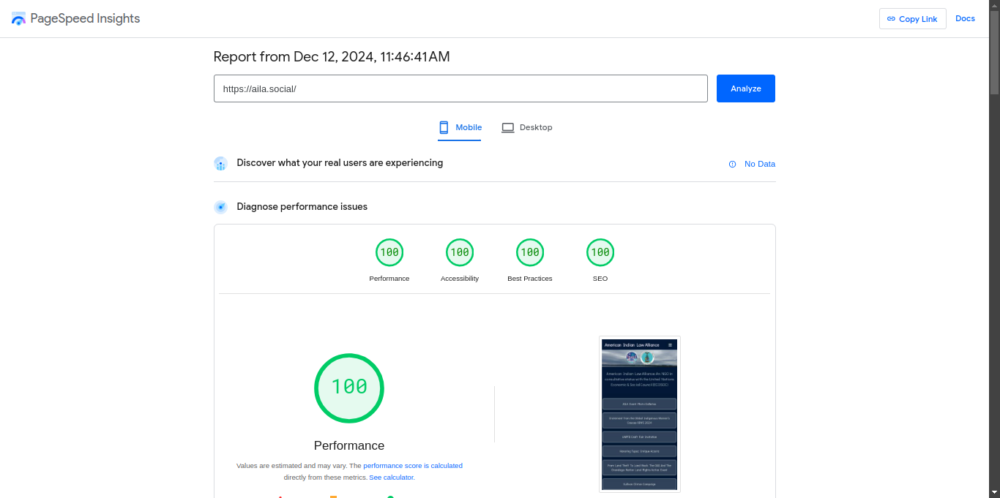

# 76 Oranges Projects

## Image Credit
Photo by <a href="https://unsplash.com/@erol?utm_content=creditCopyText&utm_medium=referral&utm_source=unsplash">Erol Ahmed</a> on <a href="https://unsplash.com/photos/orange-fruits-_MYcIi9DgYQ?utm_content=creditCopyText&utm_medium=referral&utm_source=unsplash">Unsplash</a>
      
# Adam Lists Links

Developer : [Adam Dj Brett](https://adamdjbrett.com)

For Link Lists

Mobile Test

Desktop Test

### First Setup

Open `_data/metadata.js`

the metadata files is for socialcard, meta tags, and SEO. open `_data/metadata.js` and insert title description and others for SEO.

### Configuration Navbar and Footer

To setup your navbar menu and icon on footer , you can open `_data/config.yaml`

Use fontawesome icon - https://fontawesome.com/search

copy paste icon in to icon menu.

example: `fa-solid fa-envelope`

### Link Lists

To update link list , open `content/index.md`

### Content Image

if you want to add image in to your content article , you can upload your image or media file in to `content/images`

and insert image in to your post or frontmatter, example :

`image: /images/myphoto.png`

